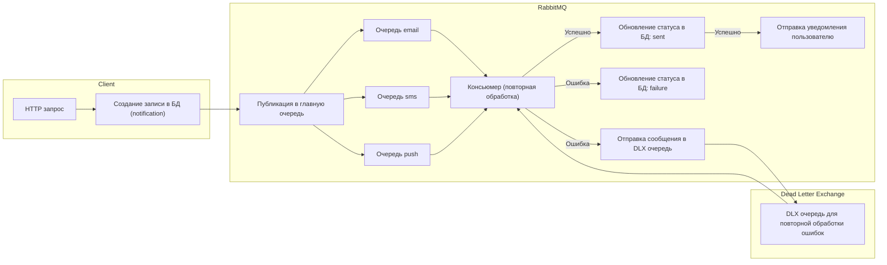
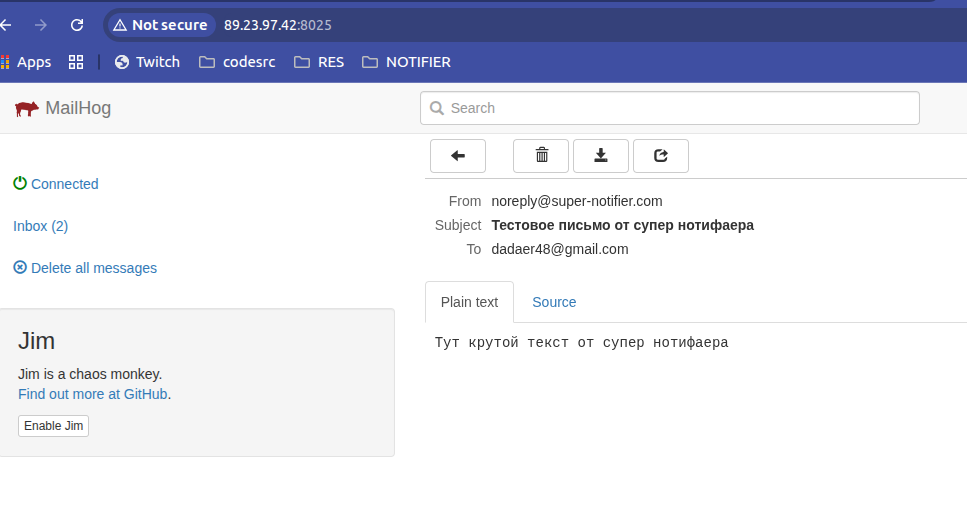

# Notifier App

## О проекте

Notifier App — это микросервисная система уведомлений для веб-приложений с Event-Driven архитектурой, обеспечивающая
надежную доставку уведомлений асинхронно.

Проект позволяет легко масштабировать отдельные сервисы, интегрироваться с внешними приложениями и расширять каналы
доставки сообщений.

## Технологии

### Dev

Framework: **Symfony 6.4**<br>
Consumer: **Symfony messenger**<br>
Queue broker: **RabbitMQ 3.12**<br>
Database: **Postgres 15**<br>
Email testing tool: **Mailhog**<br>

### Monitoring

Visualize: **Grafana + prometheus + node_exporter**

## Архитектура проекта



Диаграмма демонстрирует полный цикл обработки уведомлений в системе:

### HTTP-запрос от клиента
Клиентское приложение отправляет уведомление через HTTP-запрос к API.

### Создание записи в базе данных
После получения запроса создаётся запись в таблице notification. Эта запись содержит информацию о типе уведомления (email, SMS, push), получателе, содержимом сообщения и текущем статусе.

### Публикация в RabbitMQ
Созданное уведомление помещается в главную очередь RabbitMQ. Из главной очереди сообщения распределяются по трём специализированным очередям:

1. email
2. sms
3. push

### Обработка консьюмером
Все три очереди обрабатываются одним консьюмером. Консьюмер отвечает за доставку уведомления пользователю и обновление статуса в базе данных.

### Обновление статуса в базе

* Если уведомление доставлено успешно, статус меняется на sent.
* Если во время обработки произошла ошибка, статус меняется на failure.

### Dead Letter Exchange (DLX)
При возникновении ошибки сообщение отправляется в DLX - отдельную очередь для повторной обработки неудачных уведомлений.

### Повторная обработка из DLX
Сообщения из DLX могут быть повторно обработаны тем же консьюмером, что обеспечивает повторную попытку доставки.<br>
Это замкнутый цикл, позволяющий повышать надёжность доставки уведомлений.

## Event-Driven vs CQRS

1. **Асинхронная обработка уведомлений**
    * Уведомления создаются в реальном времени, но их доставка может занимать разное время (email, push, SMS).
    * Event-Driven подход позволяет публиковать события уведомлений в брокер сообщений и обрабатывать их асинхронно, не блокируя клиентский запрос.
---
2. **Масштабируемость сервисов**
    * Каждый тип уведомления (email, SMS, push) можно масштабировать независимо, запуская несколько консьюмеров.
    * Event-Driven архитектура минимизирует связность между компонентами, в отличие от CQRS, где команды и запросы тесно связаны.
---
3. **Гибкость интеграции с внешними сервисами**
   * Новые типы уведомлений или сервисы можно подключать просто подпиской на события.
   * CQRS потребовал бы переработки команд и запросов, что сложнее при расширении функционала.
---
4. **Простота мониторинга и логирования**
   * Каждое событие можно логировать и отслеживать в отдельности, что облегчает диагностику проблем.

## Масштабирование сервиса

1. **Горизонтальное масштабирование консьюмеров**
   * Каждый консьюмер обрабатывает сообщения из очередей (email, sms, push).
   * Можно запускать несколько экземпляров консьюмеров параллельно, чтобы увеличить пропускную способность.
   * Консьюмеры работают независимо и безопасно, благодаря очередям RabbitMQ: одно сообщение обрабатывается только одним консьюмером.
---
2. **Масштабирование отдельных очередей**
   * Для каждого типа уведомлений (email, sms, push) можно создать отдельные очереди с собственными консьюмерами.
   * Это позволяет, например, обрабатывать большое количество email-уведомлений, не замедляя обработку push или SMS.
---
3. **Масштабирование брокера сообщений (RabbitMQ)**
   * RabbitMQ поддерживает кластеризацию и распределённую обработку очередей.
   * Можно добавлять узлы брокера для увеличения надёжности и производительности.

## API методы

### 1. Email уведомление

**POST /api/notifications/email**

**Тело запроса (JSON):**

```json
{
  "recipient": "user@example.com",
  "subject": "Тема уведомления",
  "content": "Текст уведомления"
}
```

**Пример ответа (успешно):**

```json
{
  "code": "SUCCESS",
  "data": [],
  "errors": [],
  "message": "Email notification queued!"
}
```

---

### 2. Push уведомление

**POST /api/notifications/push**

**Тело запроса (JSON):**

```json
{
  "deviceToken": "user_device_token",
  "subject": "Тема уведомления",
  "content": "Текст уведомления"
}
```

**Пример успешного ответа:**

```json
{
  "code": "SUCCESS",
  "data": [],
  "errors": [],
  "message": "Push notification queued!"
}
```

---

### 3. SMS уведомление

**POST /api/notifications/sms**

**Тело запроса (JSON):**

```json
{
  "phoneNumber": "+71234567890",
  "subject": "Тема уведомления",
  "content": "Текст уведомления"
}
```

**Пример успешного ответа:**

```json
{
    "code": "SUCCESS",
    "data": [],
    "errors": [],
    "message": "Sms notification queued!"
}
```

## Примеры логов и сообщений


```log
23:10:43 INFO      [messenger] Received message App\Domain\Notification\Message\SmsNotification ["class" => "App\Domain\Notification\Message\SmsNotification"]
23:10:43 INFO      [app] Sms notification sent!
23:10:43 INFO      [messenger] Message App\Domain\Notification\Message\SmsNotification handled by App\Domain\Notification\Handler\SmsNotificationHandler::__invoke ["class" => "App\Domain\Notification\Message\SmsNotification","handler" => "App\Domain\Notification\Handler\SmsNotificationHandler::__invoke"]
23:10:43 INFO      [messenger] App\Domain\Notification\Message\SmsNotification was handled successfully (acknowledging to transport). ["class" => "App\Domain\Notification\Message\SmsNotification"]
23:10:47 INFO      [messenger] Received message App\Domain\Notification\Message\PushNotification ["class" => "App\Domain\Notification\Message\PushNotification"]
23:10:47 INFO      [app] Push notification sent!
23:10:47 INFO      [messenger] Message App\Domain\Notification\Message\PushNotification handled by App\Domain\Notification\Handler\PushNotificationHandler::__invoke ["class" => "App\Domain\Notification\Message\PushNotification","handler" => "App\Domain\Notification\Handler\PushNotificationHandler::__invoke"]
23:10:47 INFO      [messenger] App\Domain\Notification\Message\PushNotification was handled successfully (acknowledging to transport). ["class" => "App\Domain\Notification\Message\PushNotification"]
23:10:49 INFO      [messenger] Received message App\Domain\Notification\Message\SmsNotification ["class" => "App\Domain\Notification\Message\SmsNotification"]
23:10:49 INFO      [app] Sms notification sent!
23:10:49 INFO      [messenger] Message App\Domain\Notification\Message\SmsNotification handled by App\Domain\Notification\Handler\SmsNotificationHandler::__invoke ["class" => "App\Domain\Notification\Message\SmsNotification","handler" => "App\Domain\Notification\Handler\SmsNotificationHandler::__invoke"]
23:10:49 INFO      [messenger] App\Domain\Notification\Message\SmsNotification was handled successfully (acknowledging to transport). ["class" => "App\Domain\Notification\Message\SmsNotification"]
23:10:51 INFO      [messenger] Received message App\Domain\Notification\Message\EmailNotification ["class" => "App\Domain\Notification\Message\EmailNotification"]
23:10:52 INFO      [messenger] Message Symfony\Component\Mailer\Messenger\SendEmailMessage handled by Symfony\Component\Mailer\Messenger\MessageHandler::__invoke ["class" => "Symfony\Component\Mailer\Messenger\SendEmailMessage","handler" => "Symfony\Component\Mailer\Messenger\MessageHandler::__invoke"]
23:10:52 INFO      [app] Mail sent!
23:10:52 INFO      [messenger] Message App\Domain\Notification\Message\EmailNotification handled by App\Domain\Notification\Handler\EmailNotificationHandler::__invoke ["class" => "App\Domain\Notification\Message\EmailNotification","handler" => "App\Domain\Notification\Handler\EmailNotificationHandler::__invoke"]
23:10:52 INFO      [messenger] App\Domain\Notification\Message\EmailNotification was handled successfully (acknowledging to transport). ["class" => "App\Domain\Notification\Message\EmailNotification"]
23:10:52 INFO      [messenger] Received message App\Domain\Notification\Message\EmailNotification ["class" => "App\Domain\Notification\Message\EmailNotification"]
23:10:52 INFO      [messenger] Message Symfony\Component\Mailer\Messenger\SendEmailMessage handled by Symfony\Component\Mailer\Messenger\MessageHandler::__invoke ["class" => "Symfony\Component\Mailer\Messenger\SendEmailMessage","handler" => "Symfony\Component\Mailer\Messenger\MessageHandler::__invoke"]
23:10:52 INFO      [app] Mail sent!
23:10:52 INFO      [messenger] Message App\Domain\Notification\Message\EmailNotification handled by App\Domain\Notification\Handler\EmailNotificationHandler::__invoke ["class" => "App\Domain\Notification\Message\EmailNotification","handler" => "App\Domain\Notification\Handler\EmailNotificationHandler::__invoke"]
23:10:52 INFO      [messenger] App\Domain\Notification\Message\EmailNotification was handled successfully (acknowledging to transport). ["class" => "App\Domain\Notification\Message\EmailNotification"]
```



